# Kiến Trúc Chi Tiết Bộ Cộng FP16 (`ei_adder_fp16`)

## 1. Tổng Quan

### 1.1 Định dạng IEEE 754 Half-Precision (FP16)

```
Bit:   15 | 14  13  12  11  10 | 9  8  7  6  5  4  3  2  1  0
       S  |     Exponent (E)   |        Fraction (F)
       1b |       5 bits       |           10 bits
```

| Loại số | Exponent (E) | Fraction (F) | Giá trị |
|---------|-------------|-------------|---------|
| Zero | `00000` | `0000000000` | ±0 |
| Subnormal | `00000` | ≠ 0 | (-1)^S × 0.F × 2^(-14) |
| Normal | `00001`–`11110` | bất kỳ | (-1)^S × 1.F × 2^(E-15) |
| Infinity | `11111` | `0000000000` | ±∞ |
| NaN | `11111` | ≠ 0 | Not a Number |

### 1.2 Interface Module

```verilog
module ei_adder_fp16 (
    input              sys_clk,    // Clock hệ thống
    input              rst,        // Reset đồng bộ, active-high
    input              en,         // Enable
    input      [15:0]  a_in,       // Toán hạng A (FP16)
    input      [15:0]  b_in,       // Toán hạng B (FP16)
    output     [15:0]  sum_out     // Kết quả A + B (FP16)
);
```

### 1.3 Kiến Trúc Pipeline Tổng Thể

Bộ cộng sử dụng **pipeline 4 stage tổ hợp + 4 tầng thanh ghi** (3 inter-stage + 1 output):

```
┌──────────────────────────────────────────────────────────────────────┐
│                        ei_adder_fp16                                 │
│                                                                      │
│  a_in[15:0] ──┐                                                     │
│               ▼                                                      │
│  ┌─────────────────────┐    ┌────┐    ┌────────────────┐   ┌────┐   │
│  │   STAGE 0 (comb)    │───▶│ R  │───▶│ STAGE 1 (comb) │──▶│ R  │   │
│  │ Unpack + Special    │    │ 01 │    │ Alignment       │   │ 12 │   │
│  │ + Compare + Swap    │    │    │    │ (Shift Right    │   │    │   │
│  └─────────────────────┘    └────┘    │  + Sticky)      │   └────┘   │
│                                        └────────────────┘      │     │
│  b_in[15:0] ──┘                                                ▼     │
│                                                                      │
│  ┌─────────────────────┐    ┌────┐    ┌────────────────┐   ┌────┐   │
│  │   STAGE 3 (comb)    │◀───│ R  │◀───│ STAGE 2 (comb) │◀──┘    │   │
│  │ RNE Rounding        │    │ 23 │    │ Add/Sub         │        │   │
│  │ + Pack + Overflow    │    │    │    │ + Normalize     │        │   │
│  │ + Final Mux         │    └────┘    │ + Underflow     │        │   │
│  └──────────┬──────────┘              └────────────────┘         │   │
│             ▼                                                        │
│        ┌─────────┐                                                   │
│        │ R_OUT   │──────▶ sum_out[15:0]                             │
│        └─────────┘                                                   │
└──────────────────────────────────────────────────────────────────────┘
```

> [!IMPORTANT]
> **Latency = 4 clock cycles** (data vào ở cycle N, kết quả ra ở cycle N+4).
> **Throughput = 1 phép cộng/cycle** (pipeline hoàn toàn).

---

## 2. Phân Tích Chi Tiết Từng Stage

### 2.1 STAGE 0 — Unpack + Special Detect + Compare + Swap

**File:** [ei_adder_fp16.v](file:///c:/Users/Admin/Downloads/rtl/ei_adder_fp16.v#L12-L108)

Stage này thực hiện **5 công việc song song** trong cùng 1 tầng tổ hợp:

#### 2.1.1 Unpack (Tách trường)

```
a_in[15:0] ──▶ sign_a (bit 15)
               exp_a[4:0] (bits 14:10)
               frac_a[9:0] (bits 9:0)

b_in[15:0] ──▶ sign_b (bit 15)
               exp_b[4:0] (bits 14:10)
               frac_b[9:0] (bits 9:0)
```

#### 2.1.2 Special Case Detection (Phát hiện trường hợp đặc biệt)

Sử dụng 4 submodule chuyên dụng:

| Module | Instance | Chức năng |
|--------|----------|-----------|
| [ei_fp16_is_nan](file:///c:/Users/Admin/Downloads/rtl/ei_fp16_is_nan.v) | `u_a_nan`, `u_b_nan` | Phát hiện NaN: `exp == 11111 && frac != 0` |
| [ei_fp16_is_inf](file:///c:/Users/Admin/Downloads/rtl/ei_fp16_is_inf.v) | `u_a_inf`, `u_b_inf` | Phát hiện Inf: `exp == 11111 && frac == 0` |

Logic đặc biệt tổng hợp:

```
is_nan0 = is_a_nan | is_b_nan | (both_inf & sign_opposite)
                                  ▲
                                  └── (+∞) + (-∞) = NaN

is_inf0 = any_inf & ~is_nan0
```

- **NaN pattern**: `16'h7E00` = `0_11111_1000000000` (quiet NaN)
- **Inf pattern**: `{sign, 5'b11111, 10'b0}` — chọn sign từ toán hạng Inf

```
                    ┌─────────────────┐
  inf_from_a0 ─────▶│  ei_mux16       │
  inf_from_b0 ─────▶│  u_mux_inf_sel0 │──▶ sum_inf0
  sel_inf_from_b0 ──▶│  (s)            │
                    └─────────────────┘
  sel_inf_from_b0 = is_b_inf & ~is_a_inf
  (ưu tiên A nếu cả hai cùng Inf)
```

#### 2.1.3 Exponent Adjustment (Điều chỉnh Exponent cho Subnormal)

Subnormal có `exp = 0` nhưng giá trị thực tế tương ứng `exp_actual = 1` (theo IEEE 754):

```
exp_a_adj5 = (exp_a == 0) ? 5'd1 : exp_a    // ei_muxN #(5)
exp_b_adj5 = (exp_b == 0) ? 5'd1 : exp_b    // ei_muxN #(5)
```

#### 2.1.4 Mantissa 11-bit Construction (Xây dựng Mantissa 11 bit)

```
Normal:    mant_x_11 = {1'b1, frac_x}   ──▶ 1.fraction  (hidden bit = 1)
Subnormal: mant_x_11 = {1'b0, frac_x}   ──▶ 0.fraction  (hidden bit = 0)
```

Sử dụng `ei_muxN #(.WIDTH(11))` để chọn theo `exp_is_zero`.

#### 2.1.5 Compare & Swap (So sánh và Hoán đổi Big/Small)

Mục đích: **đảm bảo `|big| ≥ |small|`** để phép trừ luôn cho kết quả dương.

```
Bước 1: So sánh Exponent
  exp_a6 - exp_b6 ──▶ ei_subtractorN #(6) u_sub_ab ──▶ diff_ab, borrow_ab
  exp_b6 - exp_a6 ──▶ ei_subtractorN #(6) u_sub_ba ──▶ diff_ba, borrow_ba

  exp_a_gt_b = ~borrow_ab & (|diff_ab)
  exp_a_eq_b = ~borrow_ab & ~(|diff_ab)

Bước 2: Nếu exp bằng nhau, so sánh Mantissa
  mant_a_11 - mant_b_11 ──▶ ei_subtractorN #(11) u_sub_mant_ab

  mant_a_gt_b = ~mant_borrow_ab & (|mant_diff_ab)

Bước 3: Quyết định
  use_a_big0 = exp_a_gt_b | (exp_a_eq_b & (mant_a_gt_b | mant_a_eq_b))
  (Nếu bằng nhau hoàn toàn thì chọn A làm big)
```

Swap sử dụng các MUX:

```
                 use_a_big0
                     │
       ┌─────────────┼─────────────┐
       ▼             ▼             ▼
  ┌─────────┐  ┌──────────┐  ┌──────────┐
  │ sign_big│  │ exp_big  │  │ mant_big │
  │ ei_mux2 │  │ ei_muxN  │  │ ei_muxN  │
  │   #(1)  │  │   #(5)   │  │  #(11)   │
  └─────────┘  └──────────┘  └──────────┘
       │             │             │
       ▼             ▼             ▼
  sign_big0    exp_big_adj5_0   mant_big_11_0
               exp_small_adj5_0 mant_small_11_0
```

#### 2.1.6 Outputs → Pipeline Register S01

```
s01_d[69:0] = {
    is_nan0,           // 1 bit    [69]
    is_inf0,           // 1 bit    [68]
    same_sign0,        // 1 bit    [67]
    sign_big0,         // 1 bit    [66]
    sum_nan0[15:0],    // 16 bits  [65:50]
    sum_inf0[15:0],    // 16 bits  [49:34]
    exp_big6_0[5:0],   // 6 bits   [33:28]
    exp_small6_0[5:0], // 6 bits   [27:22]
    mant_big_11_0,     // 11 bits  [21:11]
    mant_small_11_0    // 11 bits  [10:0]
}                      // Total: 70 bits
```

---

### 2.2 STAGE 1 — Mantissa Alignment (Căn chỉnh Mantissa)

**File:** [ei_adder_fp16.v](file:///c:/Users/Admin/Downloads/rtl/ei_adder_fp16.v#L138-L161)

Mục đích: Dịch mantissa nhỏ sang phải để căn chỉnh dấu chấm nhị phân với mantissa lớn.

#### 2.2.1 Mở rộng sang 14-bit (thêm 3 bit GRS)

```
mant_big_14   = {mant_big_11,   3'b000}    // 11 + 3 = 14 bits
mant_small_14 = {mant_small_11, 3'b000}    // 11 + 3 = 14 bits
                                               ▲
                                               └── Guard (G), Round (R), Sticky (S)
```

> [!NOTE]
> 3 bit thêm vào (GRS) phục vụ cho thuật toán **Round-to-Nearest-Even (RNE)** ở Stage 3.

#### 2.2.2 Tính Exponent Difference

```
exp_diff6 = exp_big6 - exp_small6   ──▶ ei_subtractorN #(6)
```

Luôn ≥ 0 vì đã swap ở Stage 0.

#### 2.2.3 Barrel Shifter + Sticky Bit

```
                      ┌──────────────────────────────┐
mant_small_14[13:0] ──▶│  ei_shr_varN_sticky           │
exp_diff6[5:0] ────────▶│  #(.WIDTH(14), .SHAMT_W(6))  │
                      │                                │
                      │  d_out = d_in >> shamt          │──▶ small_shr14[13:0]
                      │  sticky = OR(shifted-out bits)  │──▶ small_sticky
                      └──────────────────────────────┘
```

[ei_shr_varN_sticky](file:///c:/Users/Admin/Downloads/rtl/ei_shr_varN_sticky.v) thực hiện:
- **Dịch phải biến thiên** (variable shift right) theo `exp_diff`
- **Thu thập Sticky bit**: OR của tất cả các bit bị dịch mất
- Nếu `shamt >= WIDTH` → output = 0, sticky = OR(tất cả bit input)

#### 2.2.4 Merge Sticky vào LSB

```
mant_small_align14 = {small_shr14[13:1], (small_shr14[0] | small_sticky)}
                                                           ▲
                                          Sticky OR vào bit thấp nhất
mant_big_align14   = mant_big_14          (không dịch)
```

#### 2.2.5 Outputs → Pipeline Register S12

```
s12_d[69:0] = {
    is_nan1, is_inf1, same_sign1, sign_big1,   // 4 bits
    sum_nan1[15:0], sum_inf1[15:0],             // 32 bits
    exp_big6_1[5:0],                            // 6 bits
    mant_big_align14_1[13:0],                   // 14 bits
    mant_small_align14_1[13:0]                  // 14 bits
}                                               // Total: 70 bits
```

---

### 2.3 STAGE 2 — Add/Sub + Normalize + Underflow Handling

**File:** [ei_adder_fp16.v](file:///c:/Users/Admin/Downloads/rtl/ei_adder_fp16.v#L192-L331)

Đây là stage phức tạp nhất, gồm 4 phần chính.

#### 2.3.1 Phép Cộng/Trừ Mantissa

Mở rộng sang 15-bit để bắt carry-out:

```
big15   = {1'b0, mant_big_align14}      // 15 bits
small15 = {1'b0, mant_small_align14}    // 15 bits
```

**Tính song song cả cộng và trừ:**

```
  big15 ──┬──▶ ei_adderN #(15)     ──▶ add15   (= big + small)
          │
          └──▶ ei_subtractorN #(15) ──▶ sub15   (= big - small)
```

Kết quả nào được dùng phụ thuộc vào `same_sign`:
- `same_sign = 1`: dùng `add15` (cùng dấu → cộng mantissa)
- `same_sign = 0`: dùng `sub15` (khác dấu → trừ mantissa)

#### 2.3.2 Normalize kết quả Cộng (Addition)

Khi cộng 2 mantissa cùng dấu, kết quả có thể tràn 1 bit:

```
Trường hợp 1: add15[14] = 0 → không cần dịch
  mant_add_pre14 = add15[13:0]
  exp_add_pre6   = exp_big6

Trường hợp 2: add15[14] = 1 → carry-out, cần dịch phải 1
  mant_add_pre14 = {add15[14:2], (add15[1] | add15[0])}  // merge sticky
  exp_add_pre6   = exp_big6 + 1
```

```
              add_need_shr1 = add15[14]
                     │
       ┌─────────────┼─────────────┐
       ▼             │             ▼
  add_mant14_noshr   │        add_mant14_norm
  = add15[13:0]      │        = {add15[14:2], add15[1]|add15[0]}
       │             │             │
       ▼             ▼             ▼
       └──── ei_muxN #(14) ────────┘
                     │
                     ▼
              mant_add_pre14

  exp_add_pre6 = exp_big6 + add_need_shr1   (ei_adderN #(6))
```

#### 2.3.3 Normalize kết quả Trừ (Subtraction) — LZC + Left Shift

Khi trừ, kết quả có thể có nhiều bit 0 đầu → cần normalize bằng dịch trái:

```
  sub_mag14 = sub15[13:0]         // Bỏ bit 14 (luôn 0 vì |big| ≥ |small|)

         ┌────────────────────────────────┐
         │   ei_lzcN #(.WIDTH(14))        │
         │   Leading Zero Counter         │
         │                                │
  sub_mag14 ──▶  Đếm số bit 0 từ MSB     │──▶ lzc_sub4 [3:0]
         │                                │
         └────────────────────────────────┘

  sub_mant_shifted14 = sub_mag14 << lzc_sub4     // Dịch trái bù leading zeros
  exp_sub_pre6       = exp_big6 - lzc_sub6       // Giảm exponent tương ứng
```

[ei_lzcN](file:///c:/Users/Admin/Downloads/rtl/ei_lzcN.v): duyệt từ MSB xuống, đếm số bit 0 liên tiếp cho đến khi gặp bit 1.

#### 2.3.4 Chọn kết quả Add/Sub

```
          same_sign
              │
  ┌───────────┼───────────┐
  ▼           │           ▼
sub_mant      │      mant_add_pre14
exp_sub_pre6  │      exp_add_pre6
  │           │           │
  ▼           ▼           ▼
  └─── ei_muxN #(14) ────┘  ──▶ mant_core14
  └─── ei_muxN #(6)  ────┘  ──▶ exp_core6
```

Các tín hiệu phụ:

```
exp_neg   = (same_sign) ? 0 : exp_sub_borrow    // exp bị âm?
core_zero = (same_sign) ? ~(|add) : sub_is_zero  // kết quả = 0?
```

**Quy tắc dấu:**
- Kết quả ≠ 0: `sign_core = sign_big` (dấu của số có trị tuyệt đối lớn hơn)
- Kết quả = 0 + khác dấu: `sign_core = 0` (+0, theo IEEE 754 cho RNE)
- Kết quả = 0 + cùng dấu: `sign_core = sign_big`

#### 2.3.5 Underflow to Subnormal

Khi exponent sau normalize ≤ 0, kết quả rơi vào vùng subnormal:

```
Phân loại:
  exp_is_0  = (exp_core == 0) & ~exp_neg         // exp đúng bằng 0
  exp_is_1  = (exp_core == 1) & ~exp_neg         // exp đúng bằng 1
  exp_ge_2  = (exp_core[5:1] != 0) & ~exp_neg   // exp ≥ 2

  is_normal_out = exp_ge_2 | (exp_is_1 & hidden_bit=1)
  is_sub_needshift = exp_neg | exp_is_0
```

Nếu cần chuyển sang subnormal, dịch phải mantissa thêm:

```
  shift_amt =
      exp_neg  ? (lzc - exp_big + 1) :    // exp bị âm
      exp_is_0 ? 1 :                       // exp = 0 → dịch 1
      0                                     // normal

              ┌──────────────────────────────┐
  mant_core ──▶│  ei_shr_varN_sticky           │──▶ under_shr14 + under_sticky
  shift_amt ──▶│  #(.WIDTH(14), .SHAMT_W(6))  │
              └──────────────────────────────┘

  mant_after_under14 = {under_shr14[13:1], under_shr14[0] | under_sticky}

  mant_pre_round14 = is_sub_needshift ? mant_after_under14 : mant_core14
  exp_pre_round6   = is_normal_out    ? exp_core6          : 6'd0
```

#### 2.3.6 Outputs → Pipeline Register S23

```
s23_d[56:0] = {
    is_nan2, is_inf2,                // 2 bits
    sum_nan2[15:0], sum_inf2[15:0],  // 32 bits
    sign_core_2,                     // 1 bit
    is_normal_out_2,                 // 1 bit
    exp_pre_round6_2[5:0],           // 6 bits
    mant_pre_round14_2[13:0],        // 14 bits
    core_zero_2                      // 1 bit
}                                    // Total: 57 bits
```

---

### 2.4 STAGE 3 — RNE Rounding + Pack + Overflow + Final Mux

**File:** [ei_adder_fp16.v](file:///c:/Users/Admin/Downloads/rtl/ei_adder_fp16.v#L370-L447)

#### 2.4.1 Round-to-Nearest-Even (RNE)

Tách 3 bit rounding từ mantissa 14-bit:

```
mant_pre_round14[13:0]
├── [13:3] = mant_keep11 (11 bits giữ lại)
├── [2]    = G (Guard bit)
├── [1]    = R (Round bit)
└── [0]    = S (Sticky bit)
```

**Quy tắc RNE:**

```
inc = G & (R | S | mant_keep11[0])
       ▲
       └── "Round to even": nếu G=1, R=0, S=0 (tie)
           thì chỉ inc nếu LSB=1 (để kết quả chẵn)
```

| G | R | S | LSB | inc | Giải thích |
|---|---|---|-----|-----|------------|
| 0 | x | x |  x  |  0  | < 0.5 ULP → truncate |
| 1 | 0 | 0 |  0  |  0  | = 0.5 ULP, LSB=0 (đã chẵn) → truncate |
| 1 | 0 | 0 |  1  |  1  | = 0.5 ULP, LSB=1 (lẻ) → round up |
| 1 | 0 | 1 |  x  |  1  | > 0.5 ULP → round up |
| 1 | 1 | x |  x  |  1  | > 0.5 ULP → round up |

#### 2.4.2 Thực hiện Rounding

```
  mant_keep11 + inc ──▶ ei_adderN #(11) ──▶ mant_sum11 + mant_sum_cout

  Nếu mant_sum_cout = 1 (carry-out khi round):
    mant_rounded11 = {1'b1, mant_sum11[10:1]}   // dịch phải 1
    exp_post_round = exp_pre_round + 1           // tăng exp
  Ngược lại:
    mant_rounded11 = mant_sum11
    exp_post_round = exp_pre_round
```

#### 2.4.3 Subnormal Promotion

```
sub_promote = (exp_pre_round == 0) & (mant_rounded11[10] == 1)
```

Nếu round-up khiến mantissa subnormal có hidden bit = 1 → promote thành normal với `exp = 1`.

#### 2.4.4 Pack FP16

```
exp_pack5 =
    (core_zero | rounded_is_zero) ? 5'd0 :       // Zero
    sub_promote                   ? 5'd1 :        // Subnormal → Normal
    exp_post_round[4:0]                            // Bình thường

frac_pack10 =
    (core_zero | rounded_is_zero) ? 10'd0 :       // Zero
    sub_promote                   ? 10'd0 :        // Promote: frac = 0
    mant_rounded11[9:0]                             // Fraction bits

packed_finite = {sign_core, exp_pack5, frac_pack10}   // 16 bits
```

#### 2.4.5 Overflow to Infinity

```
exp_ge_31 = exp_post_round[5] | (exp_post_round[4:0] == 5'b11111)
will_be_inf = is_normal_out & exp_ge_31

packed_inf = {sign_core, 5'b11111, 10'b0}
```

#### 2.4.6 Final Priority Mux Chain

Ba tầng MUX ưu tiên, từ thấp đến cao:

```
  ┌────────────────┐
  │ Level 1:       │   packed_finite ──▶┌──────────┐
  │ Overflow?      │   packed_inf   ──▶│ ei_mux16 │──▶ sum_normal
  │                │   will_be_inf  ──▶│          │
  └────────────────┘                    └──────────┘
                                              │
  ┌────────────────┐                          ▼
  │ Level 2:       │   sum_normal   ──▶┌──────────┐
  │ Is Infinity?   │   sum_inf      ──▶│ ei_mux16 │──▶ r_inf_normal
  │                │   is_inf       ──▶│          │
  └────────────────┘                    └──────────┘
                                              │
  ┌────────────────┐                          ▼
  │ Level 3:       │   r_inf_normal ──▶┌──────────┐
  │ Is NaN?        │   sum_nan      ──▶│ ei_mux16 │──▶ sum_final
  │ (highest prio) │   is_nan       ──▶│          │
  └────────────────┘                    └──────────┘
```

**Thứ tự ưu tiên: NaN > Inf > Overflow > Normal result**

#### 2.4.7 Output Register

```
sum_final ──▶ regN #(16) u_reg_out ──▶ sum_out[15:0]
```

---

## 3. Module Hierarchy (Cây phân cấp Module)

```mermaid
graph TD
    TOP["ei_adder_fp16<br/>Top-level FP16 Adder"]

    subgraph S0["STAGE 0: Unpack + Compare + Swap"]
        NAN_A["ei_fp16_is_nan<br/>u_a_nan"]
        NAN_B["ei_fp16_is_nan<br/>u_b_nan"]
        INF_A["ei_fp16_is_inf<br/>u_a_inf"]
        INF_B["ei_fp16_is_inf<br/>u_b_inf"]
        MUX_INF["ei_mux16<br/>u_mux_inf_sel0"]
        MUX_EA["ei_muxN #5<br/>u_exp_a_adj"]
        MUX_EB["ei_muxN #5<br/>u_exp_b_adj"]
        MUX_MA["ei_muxN #11<br/>u_mant_a_11"]
        MUX_MB["ei_muxN #11<br/>u_mant_b_11"]
        SUB_AB["ei_subtractorN #6<br/>u_sub_ab"]
        SUB_BA["ei_subtractorN #6<br/>u_sub_ba"]
        SUB_M["ei_subtractorN #11<br/>u_sub_mant_ab"]
        MUX_SB["ei_mux2<br/>u_sign_big0"]
        MUX_EBIG["ei_muxN #5<br/>u_exp_big0"]
        MUX_ESM["ei_muxN #5<br/>u_exp_small0"]
        MUX_MBIG["ei_muxN #11<br/>u_mant_big0"]
        MUX_MSM["ei_muxN #11<br/>u_mant_small0"]
    end

    REG01["regN #70<br/>u_s01"]

    subgraph S1["STAGE 1: Alignment"]
        SUB_DIFF["ei_subtractorN #6<br/>u_exp_diff1"]
        SHR1["ei_shr_varN_sticky<br/>#14,#6 u_align_small1"]
    end

    REG12["regN #70<br/>u_s12"]

    subgraph S2["STAGE 2: Add/Sub + Normalize"]
        ADD15["ei_adderN #15<br/>u_add15_2"]
        SUB15["ei_subtractorN #15<br/>u_sub15_2"]
        MUX_ANORM["ei_muxN #14<br/>u_add_norm_mux2"]
        ADD_EXP["ei_adderN #6<br/>u_exp_add_inc2"]
        LZC14["ei_lzcN #14<br/>u_lzc_sub2"]
        SUB_EXPDEC["ei_subtractorN #6<br/>u_exp_sub_dec2"]
        SUB_EXCESS["ei_subtractorN #6<br/>u_shift_excess2"]
        MUX_CORE_M["ei_muxN #14<br/>u_mant_core2"]
        MUX_CORE_E["ei_muxN #6<br/>u_exp_core2"]
        ADD_SHAMT["ei_adderN #6<br/>u_shift_amt_neg2"]
        SHR2["ei_shr_varN_sticky<br/>#14,#6 u_underflow_shr2"]
    end

    REG23["regN #57<br/>u_s23"]

    subgraph S3["STAGE 3: Round + Pack"]
        ADD_RND["ei_adderN #11<br/>u_round_add3"]
        ADD_EXP_RND["ei_adderN #6<br/>u_exp_round_inc3"]
        MUX_OVF["ei_mux16<br/>u_mux_overflow3"]
        MUX_INF_N["ei_mux16<br/>u_mux_inf_vs_normal3"]
        MUX_NAN_R["ei_mux16<br/>u_mux_nan_vs_rest3"]
    end

    REGOUT["regN #16<br/>u_reg_out"]

    TOP --> S0
    S0 --> REG01
    REG01 --> S1
    S1 --> REG12
    REG12 --> S2
    S2 --> REG23
    REG23 --> S3
    S3 --> REGOUT
```



---

## 4. Datapath tổng quát (dòng dữ liệu 14-bit mantissa)

```
  ┌───────────────────── STAGE 0 ─────────────────────┐
  │                                                     │
  │  a_in ──▶ unpack ──▶ {sign_a, exp_a, frac_a}       │
  │  b_in ──▶ unpack ──▶ {sign_b, exp_b, frac_b}       │
  │                                                     │
  │  exp_adj ──▶ compare ──▶ swap(big, small)           │
  │  mantissa 11-bit (hidden bit)                       │
  │                                                     │
  └──────────────────────┬────────────────────────────┘
                         │ 70-bit register (S01)
                         ▼
  ┌───────────────────── STAGE 1 ─────────────────────┐
  │                                                     │
  │  mant ──▶ extend 14-bit (+3 GRS)                   │
  │  exp_diff = exp_big - exp_small                     │
  │  small >> exp_diff  (barrel shifter + sticky)       │
  │                                                     │
  └──────────────────────┬────────────────────────────┘
                         │ 70-bit register (S12)
                         ▼
  ┌───────────────────── STAGE 2 ─────────────────────┐
  │                                                     │
  │  ┌─ ADD path: big + small ──▶ normalize (>>1?)     │
  │  │                                                  │
  │  ┤  (parallel)                                      │
  │  │                                                  │
  │  └─ SUB path: big - small ──▶ LZC ──▶ <<lzc       │
  │                                                     │
  │  MUX(same_sign) ──▶ mant_core, exp_core            │
  │  Underflow? ──▶ shift right to subnormal            │
  │                                                     │
  └──────────────────────┬────────────────────────────┘
                         │ 57-bit register (S23)
                         ▼
  ┌───────────────────── STAGE 3 ─────────────────────┐
  │                                                     │
  │  RNE: G,R,S ──▶ inc ──▶ mant + inc                │
  │  Pack: {sign, exp, frac}                            │
  │  Overflow ──▶ ±Inf                                  │
  │  Priority MUX: NaN > Inf > Overflow > Normal        │
  │                                                     │
  └──────────────────────┬────────────────────────────┘
                         │ 16-bit register (OUT)
                         ▼
                    sum_out[15:0]
```

---

## 5. Bảng Tổng Hợp Các Trường Hợp Đặc Biệt

| Trường hợp | A | B | Kết quả | Xử lý tại |
|-------------|---|---|---------|-----------|
| Một input là NaN | NaN | bất kỳ | NaN (`7E00`) | Stage 0 detect → Stage 3 mux |
| +∞ + (-∞) | +∞ | -∞ | NaN (`7E00`) | Stage 0: `both_inf & sign_opposite` |
| ∞ + normal | ±∞ | normal | ±∞ | Stage 0: `is_inf0` |
| Subnormal + Subnormal | sub | sub | sub/normal | Stage 0: `exp_adj=1`, hidden=0 |
| Overflow (exp ≥ 31) | large | large | ±∞ | Stage 3: `will_be_inf` |
| Exact Zero (a - a) | x | -x | +0 | Stage 2: `sign_zero = 0` |
| Subnormal promote | sub | sub | normal | Stage 3: `sub_promote` |
| Round carry overflow | — | — | exp+1 | Stage 3: `mant_sum_cout` |

---

## 6. Tổng Hợp Submodule Sử Dụng

| Module | File | Số instance | Chức năng |
|--------|------|-------------|-----------|
| [ei_fp16_is_nan](file:///c:/Users/Admin/Downloads/rtl/ei_fp16_is_nan.v) | `ei_fp16_is_nan.v` | 2 | Phát hiện NaN |
| [ei_fp16_is_inf](file:///c:/Users/Admin/Downloads/rtl/ei_fp16_is_inf.v) | `ei_fp16_is_inf.v` | 2 | Phát hiện Infinity |
| [ei_mux2](file:///c:/Users/Admin/Downloads/rtl/ei_mux2.v) | `ei_mux2.v` | 1 (trực tiếp) + nhiều (qua muxN) | MUX 1-bit cơ bản |
| [ei_mux16](file:///c:/Users/Admin/Downloads/rtl/ei_mux16.v) | `ei_mux16.v` | 4 | MUX 16-bit (built from 16× ei_mux2) |
| [ei_muxN](file:///c:/Users/Admin/Downloads/rtl/ei_muxN.v) | `ei_muxN.v` | 10 | MUX N-bit tham số hóa |
| [ei_adderN](file:///c:/Users/Admin/Downloads/rtl/ei_adderN.v) | `ei_adderN.v` | 5 | Bộ cộng N-bit (ripple-carry) |
| [ei_subtractorN](file:///c:/Users/Admin/Downloads/rtl/ei_subtractorN.v) | `ei_subtractorN.v` | 6 | Bộ trừ N-bit (bù 2) |
| [ei_lzcN](file:///c:/Users/Admin/Downloads/rtl/ei_lzcN.v) | `ei_lzcN.v` | 1 | Leading Zero Counter |
| [ei_shr_varN_sticky](file:///c:/Users/Admin/Downloads/rtl/ei_shr_varN_sticky.v) | `ei_shr_varN_sticky.v` | 2 | Barrel shifter phải + sticky |
| [ei_full_adder](file:///c:/Users/Admin/Downloads/rtl/ei_full_adder.v) | `ei_full_adder.v` | nhiều (qua adderN/subtractorN) | Full Adder 1-bit cơ bản |
| [regN](file:///c:/Users/Admin/Downloads/rtl/regN.v) | `regN.v` | 4 | Thanh ghi N-bit (sync reset, enable) |

---

## 7. Thông Số Pipeline

| Tham số | Giá trị |
|---------|---------|
| Số stage tổ hợp | 4 (S0, S1, S2, S3) |
| Số thanh ghi pipeline | 4 (S01: 70b, S12: 70b, S23: 57b, OUT: 16b) |
| Tổng flip-flop | 70 + 70 + 57 + 16 = **213 flip-flops** |
| Latency | **4 clock cycles** |
| Throughput | **1 result/cycle** |
| Chế độ làm tròn | RNE (Round-to-Nearest-Even) |
| Hỗ trợ Subnormal | ✅ Đầy đủ (cả input và output) |
| Hỗ trợ NaN/Inf | ✅ Theo IEEE 754 |
| Reset | Synchronous, active-high |
| Clock gating | Via `en` signal |
